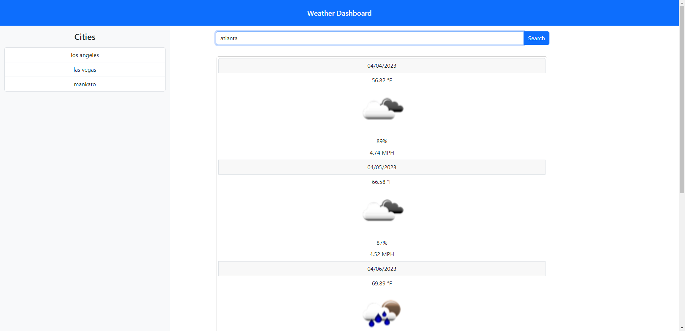

# weather-dashboard

## Description

Look up a city and see a 5 day weather forecast! Previously looked up cities will be displayed on the sidebar, and it'll bring up its forecast when you click on it for ease of use. I learned about using APIs and the data it sends back. I also made the discovery that I'm not that big of a fan of bootstrap and may consider using tailwind for a future project instead.

## Visit The Site!
You can visit the deployed website here: https://shimmyshong.github.io/weather-dashboard/

